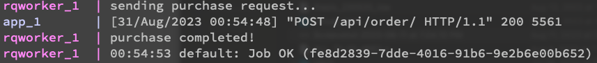

# Crypto Exchange App 🪙

This is a simple crypto exchange REST API project implemented with Django and DRF. It has three following conditions:

1. Every purchase must include the following items: Cryptocurrency name for purchase (example: ABAN), amount of cryptocurrency to purchase (example: 1).

2. To perform the purchase operation, two things must be done: 1. Deducting money from the customer's account according to the price of that cryptocurrency and the amount purchased (for simplicity, you can hard code the prices) 2. Finalize the purchased amount with international exchanges (create an empty method named buy_from_exchange that is responsible for finalizing the purchase. This method is simulated with time.sleep(5) for simplicity).

3. Since international exchanges do not support purchases under $10, for these orders, you must group orders under $10 and send the purchase request once.

## High Level Logic

The endpoints are located in `app/main/views.py`. Because we have external requests in our endpoint, it is desirable to handle them in background using some kind of job queues and a worker. In addition, we should store previous orders so that we buy crypto whenever the orders become more than $10. So we have two models in our DB:

```python
class Customer(models.Model):
    name = models.CharField(max_length=20)
    balance = models.DecimalField(max_digits=10, decimal_places=2, default=100.00)

class Order(models.Model):
    customer = models.ForeignKey(Customer, on_delete = models.CASCADE)
    price = models.DecimalField(max_digits=10, decimal_places=2, default=0.00)
    quantity = models.DecimalField(max_digits=20, decimal_places=10, default=0.0)
    status = models.CharField(
        max_length=20,
        choices=[
            ('pending', 'Pending'),
            ('completed', 'Completed'),
        ],
        default='pending'
    )
```

Orders less than 10$ are stored with `pending` status. With every request less than 10$, we check the DB to see if total pending orders surpass 10$, if it is, we make the request using this line of code:

```python
buy_from_exchange.delay(crypto, amount)
```

For simplicity, only one price (`CRYPTO_PRICE` in `app/main/commons.py`) is considered for cryptocurrencies.


## Implementation Details

### Docker services

Total of 4 docker services are considered here. `redis` and `rqworker` services are considered to handle the external requests (international exchange) asynchronously in the background. [RQ (Redis Queue)](https://python-rq.org/) package is used for handling jobs, which has more than 9k stars on its github.

```yaml
version: "3.8"

services:
  app:
    build:
     context: .
    image: crypto_app
    ports:
     - "8000:8000"
    volumes:
      - ./app:/app
    command: >
      sh -c "python manage.py wait_for_db &&
             python manage.py migrate &&
             python manage.py runserver 0.0.0.0:8000"
    environment:
      - DB_HOST=db
      - DB_NAME=devdb
      - DB_USER=devuser
      - DB_PASS=changeme
    depends_on:
      - db
      - redis
  
  db:
    image: postgres:14.9-alpine
    environment:
      POSTGRES_DB: devdb
      POSTGRES_USER: devuser
      POSTGRES_PASSWORD: changeme
    ports:
      - "5432:5432"
    expose:
      - 5432
    volumes:
      - dev-db-data:/var/lib/postgresql/data/

  redis:
    image: redis:latest
    ports:
      - "6379:6379"
    expose:
      - 6379
  
  rqworker:
    image: crypto_app
    volumes:
      - ./wait-for-it.sh:/app/wait-for-it.sh
    command: >
      sh -c "/app/wait-for-it.sh app:8000 &&
             python manage.py rqworker"
    depends_on:
      - redis

volumes:
  dev-db-data:
```

### OOP and SOLID considerations

Main endpoint uses a combination of `Strategy` and `Factory` design pattern. Strategies are implemented based on the `OrderStrategy` Interface (abstract class). This pattern is a perfect match for this use case since we have two strategies: one for orders less than 10$ and one for more than 10$. These two are implemented with `SmallOrderStrategy` and `LargeOrderStrategy` classes.

```python
class OrderStrategy(ABC):
    @abstractmethod
    def execute(self, request, customer, crypto, amount, total_price):
        pass


class SmallOrderStrategy(OrderStrategy):
    def execute(self, request, customer, crypto, amount, total_price):
        # execution details...


class LargeOrderStrategy(OrderStrategy):
    def execute(self, request, customer, crypto, amount, total_price):
        # execution details...


class OrderStrategyFactory:
    @staticmethod
    def create_strategy(total_price):
        if total_price < PURCHASE_THRESHOLD:
            return SmallOrderStrategy()
        else:
            return LargeOrderStrategy()
```

### Atomic Endpoint

The endpoint acts as a transaction unit to avoid incomplete execution and ensure consistency.

```python
@transaction.atomic
    def post(self, request, format=None):
```

### Endpoint Tests

External request is mocked in the tests to avoid actual lengthy execution.

```python
class OrderViewTestCase(TestCase):
    def setUp(self):
        self.client = APIClient()
        # Create a customer with sufficient balance for testing
        self.customer = Customer.objects.create(name='john', balance=50)
        
    @patch('main.views.OrderStrategyFactory.create_strategy')
    def test_successful_order(self, mock_create_strategy):
        # Execution details...

    def test_insufficient_balance(self):
        # Execution details...
```

### Style

Code is formatted with [Black](https://github.com/psf/black) based on some of [PEP 8](https://peps.python.org/pep-0008/) guidelines such as line length of 79 characters.

## Running the App

```sh
docker-compose build
dokcer-compose up
```

create some users by going to http://127.0.0.1:8000/api/customer/ and creating some dummy customers:

```json
{
    "name": "farbod",
    "balance": "100.00"
}
```
then go to http://127.0.0.1:8000/api/order/ and POST an order:
```json
{
    "crypto": "ABAN",
    "amount": 1.5,
    "customer_id": 1
}
```
You will get an instant response and you will triger a job in the redis queue. After 5 seconds you can see the output on stdout:



## Important Notes

* Wallet balance was considered at first, but it is not implemented due to limited time-frame (and I think it was not relevant according to task description).
* External requests may fail in real-world scenarios. Due to limited time-frame and simplicity, failed request scenario is not implemented here.
